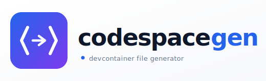

 <picture >
 	  <source media="(prefers-color-scheme: dark)" srcset="./logo-dark.svg">
	  <source media="(prefers-color-scheme: light)" srcset="./logo-light.svg">
	  
  </picture>


[日本語版はこちら](README.ja.md)

codespacegen is a CLI that generates the following three files for Codespaces and devcontainers.

- Dockerfile
- devcontainer.json
- docker-compose.yaml

## Architecture

- Domain: rules and models
	- internal/domain/entity
	- internal/domain/service
- App composition and orchestration
	- internal/app
- Input adapters (CLI/JSON/defaults)
	- internal/input
- Config resolution (interactive/default merge)
	- internal/resolve
- Workflows (use cases)
	- internal/workflow/collect
	- internal/workflow/assemble
	- internal/workflow/generate
- Artifact generation and file writing
	- internal/generator
	- internal/generator/filewriter
- i18n resources
	- internal/i18n
- Entry point: CLI
	- cmd/codespacegen

Dependencies only point inward.

## Usage

### Run

```bash
go run ./cmd/codespacegen
```

By default, files are generated under .devcontainer.

### Main options

| Option | Default | Description |
|---|---|---|
| `-output` | `.devcontainer` | Output directory |
| `-name` | *(interactive, required)* | Project name. Prompted every time and mapped to the `name` field in `devcontainer.json` |
| `-language` | *(interactive, empty on Enter)* | Programming language key. Prompted every time. Any key defined in `codespacegen.json` (or the file specified by `-image-config`) can be used. If empty, no language-specific setting is used and `alpine:latest` is selected |
| `-service` | *(interactive, `app` on Enter)* | Docker Compose service name. Prompted every time and reflected in both `devcontainer.json` and `docker-compose.yaml` |
| `-workspace-folder` | *(interactive, `/workspace` on Enter)* | Workspace path inside the container. Prompted every time |
| `-timezone` | *(interactive, default from `common.timezone` or `UTC`)* | Timezone inside the container. Prompted every time and reflected in `ENV TZ` and timezone setup in the Dockerfile |
| `-base-image` | *(language default)* | Explicit Docker base image. Overrides the default derived from `-language` |
| `-image-config` | `codespacegen.json` | Local path or `https://` URL for base image definitions. Supports top-level `common` defaults plus per-language entries. `image` is required when `install` is specified; it can be omitted for timezone- or extension-only entries when `common` provides the image |
| `-port` | *(interactive, no ports on Enter)* | Port mapping. For example, `3000` is normalized to `3000:3000`, and `8080:3000` is also accepted. Prompted every time |
| `-compose-file` | `docker-compose.yaml` | Compose file name |
| `-force` | `false` | Overwrite existing files |
| `-lang` | *(auto-detect)* | Language for CLI messages (`en` or `ja`). Defaults to system locale |
| `-v` | — | Print version and exit |

Base image definitions are separated into [codespacegen.json](codespacegen.json) at the repository root.

- If the JSON file exists: values are loaded from the file
- If `-base-image` is specified: it takes precedence over the JSON config

The generated `devcontainer.json` always includes:

- `GitHub.copilot`
- `GitHub.copilot-chat`

In addition, extension IDs from `codespacegen.json` (`common.vscodeExtensions` and per-language `vscodeExtensions`) are appended.

### codespacegen.json format

You can attach the JSON Schema in editors that support JSON Schema validation and completion.

```json
{
	"$schema": "./codespacegen.schema.json",
	"go": "golang:1.24-alpine"
}
```

If `codespacegen.json` is at the repository root, `./codespacegen.schema.json` points to the bundled schema file in this repository.

**Pattern 1: string value for a direct image name**

```json
{
	"go": "golang:1.24-alpine"
}
```

**Pattern 2: object value for install commands, timezone, locale, and VS Code extensions (`image` is required when `install` is specified)**

```json
{
	"moonbit": {
		"image": "ubuntu:24.04",
		"install": "curl -fsSL https://cli.moonbitlang.com/install/unix.sh | bash",
		"timezone": "UTC",
		"locale": {
			"lang": "ja_JP.UTF-8",
			"language": "ja_JP:ja",
			"lcAll": "ja_JP.UTF-8"
		},
		"vscodeExtensions": ["moonbit.moonbit-lang"]
	}
}
```

The generated Dockerfile adds the following `RUN` step.

```dockerfile
RUN curl -fsSL https://cli.moonbitlang.com/install/unix.sh | bash
```

**Pattern 3: shared defaults with `common`**

```json
{
	"common": {
		"timezone": "Asia/Tokyo",
		"locale": {
			"lang": "ja_JP.UTF-8",
			"language": "ja_JP:ja",
			"lcAll": "ja_JP.UTF-8"
		},
		"vscodeExtensions": [
			"MS-CEINTL.vscode-language-pack-ja",
			"streetsidesoftware.code-spell-checker"
		]
	},
	"go": {
		"image": "golang:1.24-alpine",
		"vscodeExtensions": ["golang.Go"]
	}
}
```

Merge behavior:

- `common` is applied first, then language-specific values override/append
- `vscodeExtensions` are merged in order and de-duplicated
- `locale` is treated as a whole: if the language entry defines `lang`, its full `locale` object takes precedence; otherwise `common.locale` is used
- If timezone is not set in flags or config, `UTC` is used

Patterns 1, 2, and 3 can be mixed in the same file.

Example:

```bash
go run ./cmd/codespacegen \
	-output .devcontainer \
	-name "My Codespace" \
	-language go \
	-service app \
	-workspace-folder /workspace \
	-timezone Asia/Tokyo \
	-compose-file docker-compose.yaml \
	-force
```

Example using a remote JSON URL:

```bash
go run ./cmd/codespacegen -image-config https://example.com/my-base-images.json -language go -force
```

- Only `https://` URLs are supported. `http://` is rejected
- If the JSON is missing or not specified, built-in Alpine defaults are used

Example overriding with an explicit image:

```bash
go run ./cmd/codespacegen -language python -base-image python:3.12-alpine -force
```

Example exposing a port:

```bash
go run ./cmd/codespacegen -language go -port 3000 -force
```

If `-port` is not specified, the CLI prompts for a port interactively during execution.

The generated `docker-compose.yaml` looks like this, with `ports` added only when a port is provided.

```yaml
services:
		app:
			build: .
			tty: true
			volumes:
				- ../:/workspace
```

## Tests

```bash
go test ./...
```

## Release with GitHub Actions

When you push a tag, GitHub Actions cross-builds binaries and uploads them to GitHub Releases.

```bash
git tag v0.1.0
git push origin v0.1.0
```

Main generated assets:

- `codespacegen_linux_amd64.tar.gz`
- `codespacegen_linux_arm64.tar.gz`
- `codespacegen_darwin_amd64.tar.gz`
- `codespacegen_darwin_arm64.tar.gz`
- `codespacegen_windows_amd64.exe`
- `checksums.txt`

## Install with curl

The latest release is downloaded automatically and installed into `/usr/local/bin`.

```bash
curl -fsSL https://raw.githubusercontent.com/taka1156/codespacegen/master/scripts/install.sh | bash
```

To change the install destination:

```bash
curl -fsSL https://raw.githubusercontent.com/taka1156/codespacegen/master/scripts/install.sh | INSTALL_DIR=$HOME/.local/bin bash
```
